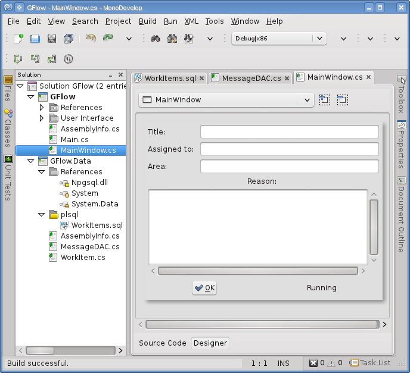

# Utilizando parameterized commands (comandos con parámetros) de ADO.NET en PostgreSQL con GTK#

Para complementar el tema del <a href="http://xomalli.blogspot.mx/2012/08/utilizando-parameterized-commands.html">post  anterior</a>, como un segundo ejemplo mostramos un formulario GTK# que utiliza una función  PL/SQL, en donde además de los parámetros de entrada se establecen dos parámetros de salida, los cuales una vez de ejecutada la función devuelve los valores número de referencia y la fecha actual, que el formulario GTK# muestra en un mensaje. Para preparar el ejemplo, creamos una base de datos llamada Test con una tabla llamada workitems en donde la función creará un nuevo registro. Aquí el código de la tabla:
 
<!--Code table-->

 
<!--Code-->
 
A continuación el código de la función.
 
<!--Code-->

 
<!--Code-->
 

Esta función utiliza la función <i>createrefnum(id)</i>   utilizada en la <a href="http://xomalli.blogspot.mx/2012/08/utilizando-parameterized-commands.html">primera parte de este tutorial</a>. En esta función los parámetros de salida se especifican con la palabra reservada OUT junto a los parámetros de entrada en los argumentos, inmediatamente después del la declaración del nombre, como se muestra el siguiente fragmento del código.

<pre>
create or replace function usp_createworkitem(out nref varchar,varchar,varchar,varchar,varchar,out creationDate timestamp) 
<pre>

En este ejemplo debemos de tener una solución en MonoDevelop con dos tipos de proyectos: uno de tipo library en donde se pondrán las siguientes clases:  WorkItem.cs : representa la clase de transporte de datos o POCO. MessageDAC.cs: que representa la clase de acceso a PostgreSQL.  El otro es un proyecto tipo GTK# que contiene las clases Main.cs y MainWindow.cs correspondientes a la GUI del formulario y al manejo de eventos. La solución deberá de verse como en la siguiente imagen:
 

El diseño del formulario queda como en la siguiente imagen:

En la clase <i>MessageDAC</i> se encuentra el código en donde ejecutamos la función, para que se ejecute correctamente debemos establecer la propiedad <i>CommandType</i> de la clase <i>NpgsqlCommand</i> con el valor de la enumeración <i>CommandType.StoredProcedure</i>.
 

<pre>
cmd.CommandType = CommandType.StoredProcedure;
</pre>

 Entonces creamos los parámetros de entrada y de salida, para los de salida se crea un  <i>NpgsqlParameter</i> por cada uno y se establece  su propiedad <i>Direction</i> con la enumeración <i>ParameterDirection.Output</i>, es importante no olvidar agregarlos a la enumeración <i>Parameters</i> del <i>NpgsqlCommand</i>.

 

<pre>
NpgsqlParameter nref = new NpgsqlParameter("nref",NpgsqlDbType.Varchar);
nref.Direction = ParameterDirection.Output;
cmd.Parameters.Add(nref);
cmd.Parameters.Add("Title",NpgsqlDbType.Varchar).Value = wk.Title;
cmd.Parameters.Add("AssignedTo",NpgsqlDbType.Varchar).Value = wk.AssignedTo;
cmd.Parameters.Add("Area",NpgsqlDbType.Varchar).Value = wk.Area;
cmd.Parameters.Add("Reason",NpgsqlDbType.Varchar).Value = wk.Reason;
NpgsqlParameter created = new NpgsqlParameter("creationDate",NpgsqlDbType.Timestamp);
created.Direction = ParameterDirection.Output;
cmd.Parameters.Add(created);
</pre>

 

Después de ejecutar el comando para llamar la función obtenemos el valor de regreso, haciendo referencia por su nombre de la enumeración <i>Parameters</i>.
 

<pre>
wk.Numref = cmd.Parameters["nref"].Value.ToString();
wk.Created = Convert.ToDateTime(cmd.Parameters["creationDate"].Value);
</pre>

 
Al compilar y ejecutar el formulario se verá como en la siguiente imagen:
 

 

Al introducir los valores y presionar el botón OK se ejecutará el llamado a la función agregando el registro y devolviendo los valores de salida, que se mostrarán con un mensaje como se ve en la siguiente imagen:
 

 

Si todo se ejecuto correctamente, podemos consultar el registro ejecutando el siguiente comando desde una terminal:
 
<pre> $ psql Test –c “Select * from workitems” - A </pre> 

